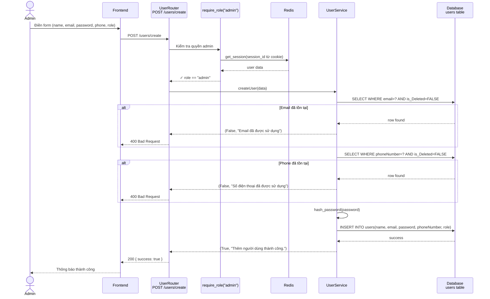
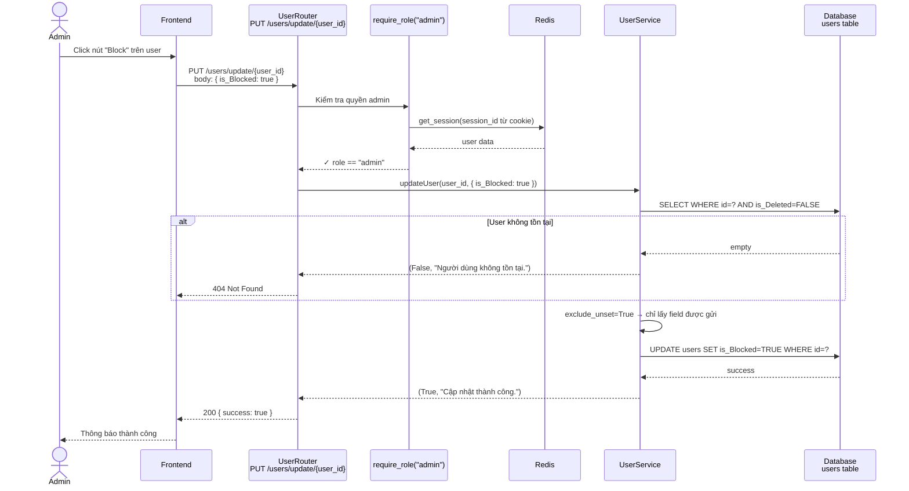

# Sequence Diagrams — User Management & Subscription
> Người phụ trách: **Tâm**
> Module: **User Management** (Seq 3, 4) · **Subscription** (Seq 12, 13)

---

## Checklist nhanh

| # | Tên | Status |
|---|-----|--------|
| 3 | Create User (Admin) | ✅ Done |
| 4 | Block User (Admin) | ✅ Done |
| 12 | Activate Subscription | ✅ Done |
| 13 | Extend Subscription | ✅ Done |

---

## Sequence 3 — Create User (Admin)

**Endpoint:** `POST /users/create`  
**Files:** `app/routes/user_router.py` · `app/services/user_services.py`



### Code chính

**Router** (`user_router.py`):
```python
@router.post("/create")
def create_user(data: CreateUserRequest, user=Depends(require_role("admin"))):
    success, message = createUser(data)
    if not success:
        raise HTTPException(status_code=400, detail=message)
    return {"success": True, "message": message}
```

**Service** (`user_services.py`):
```python
def createUser(data):
    conn = get_db_connection()
    cursor = conn.cursor(dictionary=True)
    # 1. Check email trùng
    cursor.execute("SELECT id FROM users WHERE email=%s AND is_Deleted=FALSE", (data.email,))
    if cursor.fetchone():
        return (False, "Email đã được sử dụng")
    # 2. Check phone trùng
    cursor.execute("SELECT id FROM users WHERE phoneNumber=%s AND is_Deleted=FALSE", (data.phoneNumber,))
    if cursor.fetchone():
        return (False, "Số điện thoại đã được sử dụng")
    # 3. Hash password + INSERT
    hashed = hash_password(data.password)
    cursor.execute(
        "INSERT INTO users(name,email,password,phoneNumber,role) VALUES(%s,%s,%s,%s,%s)",
        (data.name, data.email, hashed, data.phoneNumber, data.role)
    )
    conn.commit()
    return (True, "Thêm người dùng thành công.")
```

### Câu hỏi vấn đáp
| Câu hỏi | Trả lời |
|---|---|
| Tại sao kiểm tra `is_Deleted=FALSE` khi check email? | Tránh conflict với email của user đã xóa mềm — họ có thể đăng ký lại |
| Password lưu như thế nào? | Bcrypt hash, không lưu plain text |
| Auth verify ở đâu? | `require_role("admin")` là FastAPI Dependency — đọc session từ Redis, không query DB |

---

## Sequence 4 — Block User (Admin)

**Endpoint:** `PUT /users/update/{user_id}` với body `{ "is_Blocked": true }`  
**Files:** `app/routes/user_router.py` · `app/services/user_services.py`



### Code chính

**Router** (`user_router.py`):
```python
@router.put("/update/{user_id}")
def update_user(user_id: int, data: UpdateUserRequest, user=Depends(require_role("admin"))):
    success, message = updateUser(user_id, data)
    if not success:
        status_code = 404 if "không tồn tại" in message else 400
        raise HTTPException(status_code=status_code, detail=message)
    return {"success": True, "message": message}
```

**Service** (`user_services.py`):
```python
def updateUser(user_id, data):
    conn = get_db_connection()
    cursor = conn.cursor(dictionary=True)
    # 1. Kiểm tra user tồn tại
    cursor.execute("SELECT id FROM users WHERE id=%s AND is_Deleted=FALSE", (user_id,))
    if not cursor.fetchone():
        return (False, "Người dùng không tồn tại.")
    # 2. Chỉ update field được gửi
    update_data = data.model_dump(exclude_unset=True)
    # ... build dynamic UPDATE query ...
    cursor.execute(f"UPDATE users SET {fields} WHERE id=%s", values)
    conn.commit()
    return (True, "Cập nhật thành công.")
```

### Câu hỏi vấn đáp
| Câu hỏi | Trả lời |
|---|---|
| Block và Delete khác gì nhau? | Block: `is_Blocked=true`, user vẫn còn. Delete: `is_Deleted=true` (soft delete, ẩn khỏi hệ thống) |
| Tại sao không có endpoint `/block` riêng? | Tái sử dụng `updateUser` — linh hoạt hơn, update bất kỳ field nào |
| `exclude_unset=True` nghĩa là gì? | Chỉ lấy field được gửi trong request, không ghi đè field khác bằng None |

---

## Sequence 12 — Activate Subscription (Lần đầu đăng ký)

**Endpoint:** `GET /payments/vnpay-ipn` (VNPay tự callback, không phải user gọi)  
**Files:** `app/routes/payment_router.py` · `app/services/payment_services.py`

```mermaid
sequenceDiagram
    participant VNPay as VNPay Gateway
    participant Router as PaymentRouter<br/>GET /payments/vnpay-ipn
    participant Service as handle_vnpay_ipn()
    participant Activate as activate_package()
    participant DB as Database

    VNPay->>Router: GET /vnpay-ipn?vnp_TxnRef=...&vnp_ResponseCode=00
    Router->>Service: handle_vnpay_ipn(params)

    Service->>Service: verify_vnpay(params)<br/>Xác minh chữ ký HMAC-SHA512
    alt Chữ ký sai
        Service-->>Router: { RspCode: "97", "Invalid Signature" }
    end

    Service->>DB: SELECT * FROM payments WHERE transaction_ref=?
    alt Payment không tồn tại
        Service-->>Router: { RspCode: "01", "Order not found" }
    end
    Service->>Service: Kiểm tra amount khớp
    Service->>Service: Kiểm tra status == "pending"
    alt Đã xử lý rồi
        Service-->>Router: { RspCode: "02", "Order already confirmed" }
    end

    Service->>DB: UPDATE payments SET status='success'
    Service->>Activate: activate_package(user_id, package_id, payment_id)
    Activate->>DB: SELECT target_role, duration_hours FROM subscription_packages
    Activate->>DB: SELECT * FROM tourist_subscriptions<br/>WHERE user_id=? AND end_time > NOW()
    alt Chưa có subscription (INSERT mới)
        Activate->>DB: INSERT INTO tourist_subscriptions<br/>(user_id, start_time, end_time, payment_id)
    end
    DB-->>Activate: success
    Service-->>Router: { RspCode: "00", "Confirm Success" }
    Router-->>VNPay: 200 OK
```

### Code chính

**`activate_package()`** (`payment_services.py`):
```python
def activate_package(cursor, user_id, package_id, payment_id):
    cursor.execute("SELECT target_role, duration_hours FROM subscription_packages WHERE id=%s", (package_id,))
    pkg = cursor.fetchone()
    now = datetime.now()
    duration = timedelta(hours=pkg["duration_hours"])
    table = "tourist_subscriptions" if pkg["target_role"] == "tourist" else "vendor_subscriptions"

    # Kiểm tra có sub hiện tại không
    cursor.execute(f"SELECT * FROM {table} WHERE user_id=%s AND end_time > NOW() ORDER BY end_time DESC LIMIT 1", (user_id,))
    current = cursor.fetchone()

    if current:
        # Seq 13: Gia hạn
        new_end = current["end_time"] + duration
        cursor.execute(f"UPDATE {table} SET end_time=%s, payment_id=%s WHERE id=%s", (new_end, payment_id, current["id"]))
    else:
        # Seq 12: Tạo mới
        cursor.execute(f"INSERT INTO {table}(user_id, start_time, end_time, payment_id) VALUES(%s,%s,%s,%s)",
                       (user_id, now, now + duration, payment_id))
```

### Câu hỏi vấn đáp
| Câu hỏi | Trả lời |
|---|---|
| IPN là gì? | Instant Payment Notification — VNPay tự callback vào backend sau khi thanh toán |
| Tại sao cần verify chữ ký? | Bảo mật — ngăn giả mạo callback để activate subscription miễn phí |
| Tại sao check `status == "pending"`? | Tránh xử lý 2 lần nếu VNPay gọi lại nhiều lần (idempotency) |
| Bảng nào lưu subscription? | `tourist_subscriptions` hoặc `vendor_subscriptions` — phân theo role |

---

## Sequence 13 — Extend Subscription (Gia hạn)

**Endpoint:** Cùng `GET /payments/vnpay-ipn` — chỉ khác logic trong `activate_package()`  
**Files:** `app/services/payment_services.py`

```mermaid
sequenceDiagram
    participant VNPay as VNPay Gateway
    participant Router as PaymentRouter<br/>GET /payments/vnpay-ipn
    participant Service as handle_vnpay_ipn()
    participant Activate as activate_package()
    participant DB as Database

    VNPay->>Router: GET /vnpay-ipn?vnp_TxnRef=...&vnp_ResponseCode=00
    Router->>Service: handle_vnpay_ipn(params)
    Service->>Service: verify_vnpay() ✓
    Service->>DB: Kiểm tra payment hợp lệ + status=pending
    Service->>DB: UPDATE payments SET status='success'
    Service->>Activate: activate_package(user_id, package_id, payment_id)

    Activate->>DB: SELECT duration_hours FROM subscription_packages
    Activate->>DB: SELECT * FROM tourist_subscriptions<br/>WHERE user_id=? AND end_time > NOW()
    alt Đã có subscription còn hạn (GIA HẠN)
        Activate->>Activate: new_end = current.end_time + duration_hours
        Activate->>DB: UPDATE tourist_subscriptions<br/>SET end_time=new_end WHERE id=current.id
    end
    DB-->>Activate: success
    Service-->>Router: { RspCode: "00", "Confirm Success" }
    Router-->>VNPay: 200 OK
```

### Điểm khác biệt Seq 12 vs Seq 13

| | Seq 12 — Activate | Seq 13 — Extend |
|---|---|---|
| Điều kiện | Không có sub hiện tại | Còn sub chưa hết hạn |
| DB action | INSERT mới | UPDATE end_time |
| start_time | NOW() | Không đổi |
| end_time | NOW() + duration | current.end_time + duration |

### Câu hỏi vấn đáp
| Câu hỏi | Trả lời |
|---|---|
| Gia hạn cộng từ đâu? | Cộng từ `end_time` hiện tại, không phải từ NOW() → không mất phần còn lại |
| Có tạo record mới khi gia hạn không? | Không — UPDATE record cũ, tiết kiệm storage, dễ query |
| Tourist và Vendor dùng bảng khác nhau không? | Có — `tourist_subscriptions` vs `vendor_subscriptions` |

---

## Tóm tắt để nhớ nhanh

```
Seq 3: Admin tạo user
  → check email/phone trùng → hash password → INSERT

Seq 4: Admin block user  
  → updateUser với is_Blocked=true → UPDATE

Seq 12: Lần đầu mua gói (IPN callback)
  → verify chữ ký → check pending → UPDATE payment → INSERT subscription

Seq 13: Gia hạn gói (IPN callback)
  → verify chữ ký → check pending → UPDATE payment → UPDATE end_time
```
